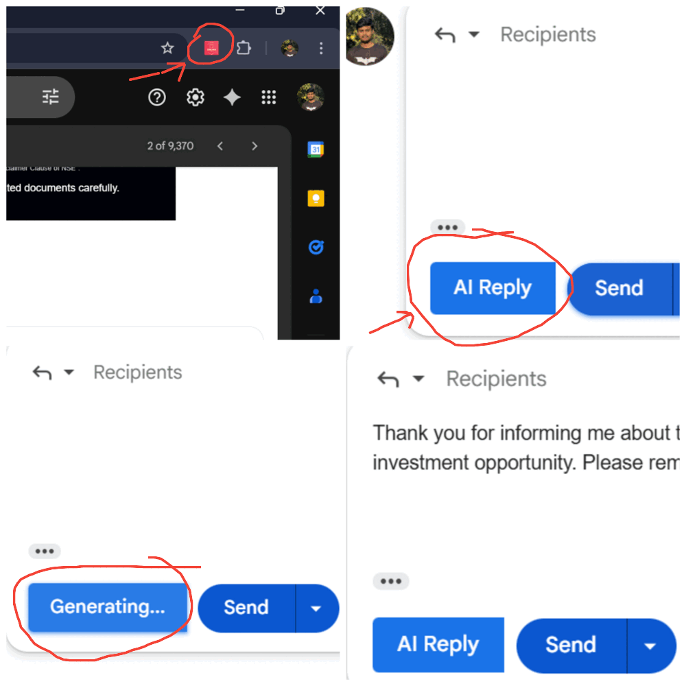

# 📧 Email Writer Assistant

AI-powered email reply generator that integrates directly into Gmail via a Chrome extension.

---



_(Replace this image with your actual screenshot: place your image as `images/screenshot.png` inside your project folder so it appears here on GitHub.)_

---

## 🚀 Features

✅ Detects Gmail compose windows automatically  
✅ Injects an “AI Reply” button next to the send button  
✅ Generates email replies using your AI API server  
✅ Supports dynamic updates when you open or close Gmail compose windows

---

## 📂 Project Structure

Your project folder should look like this:
email-writer-ext/
├── manifest.json
├── content.js
├── content.css
├── README.md
└── images/
└── screenshot.png

---

## 🛠 Setup Instructions

Follow these steps to install your Chrome extension locally:

1. **Prepare your files**

   Make sure the following files exist in your `email-writer-ext/` folder:

   - `manifest.json`
   - `content.js`
   - `content.css`
   - `README.md`
   - `images/guide.gif`. -->if you want you can remove this it is not taht so imp folder

2. **Load the extension into Chrome**

   - Open Google Chrome.
   - Go to `chrome://extensions/` in the address bar.
   - Enable **Developer mode** using the toggle switch in the top right.
   - Click the **Load unpacked** button.
   - Select your `email-writer-ext/` folder.

3. **Pin the extension**

   - Click the puzzle icon in Chrome’s toolbar.
   - Pin **Email Writer Assistant** so it’s always visible.

---

## ⚙️ Usage

- Open [Gmail](https://mail.google.com) in Chrome.
- Click **Compose** to start a new email.
- You will see an **AI Reply** button next to the Gmail send button.
- Click **AI Reply** → it will show a “Generating…” state → your AI backend will generate a response.
- The generated reply will be inserted directly into your email draft.

---

## 🔗 API Backend

Your extension will send requests to your backend API at:
https://chrome-extention-email-reply-ai.onrender.com/api/email/generate

Make sure your server:

- Accepts requests from Gmail (`mail.google.com`).
- Returns responses in JSON format, e.g.:
  ```json
  {
    "reply": "Hi there, thanks for reaching out!"
  }
  ```

📝 Notes
The extension currently only works with the desktop version of Gmail.

Gmail updates its internal HTML/CSS classes often; if the AI button stops working, you may need to update selectors in content.js.
